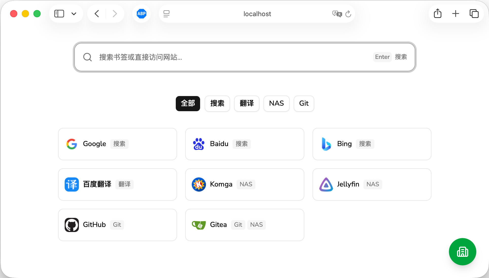
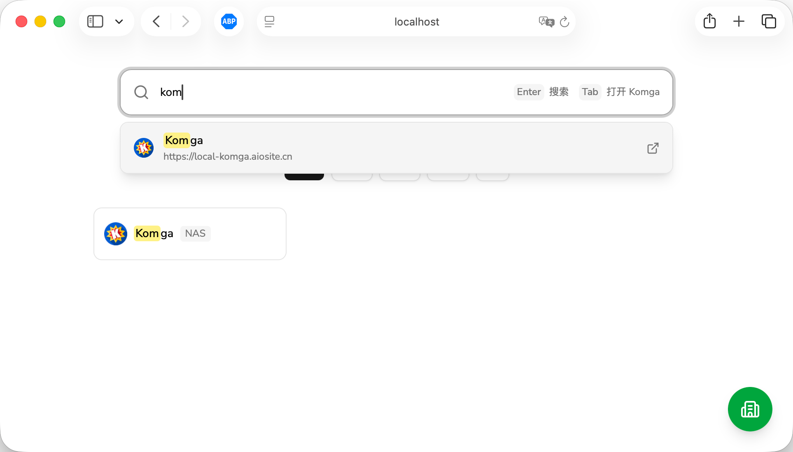
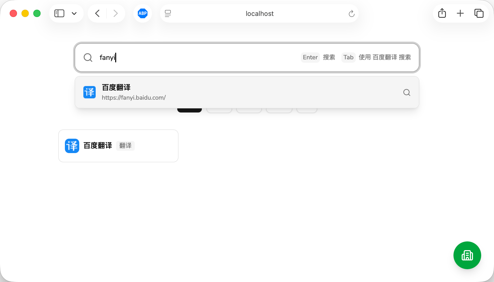
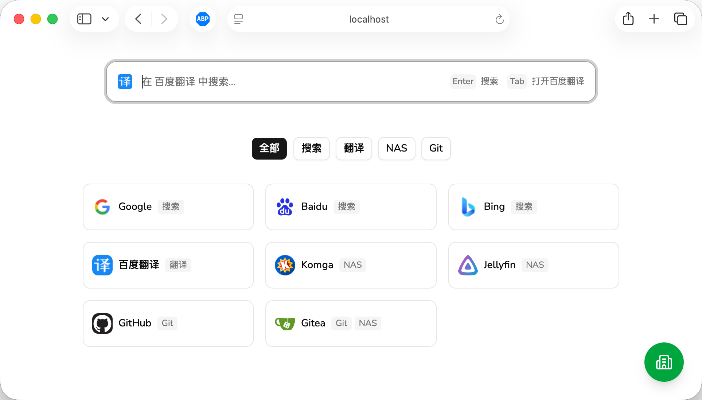
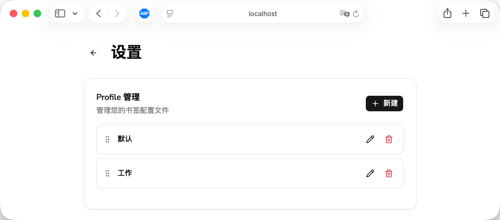
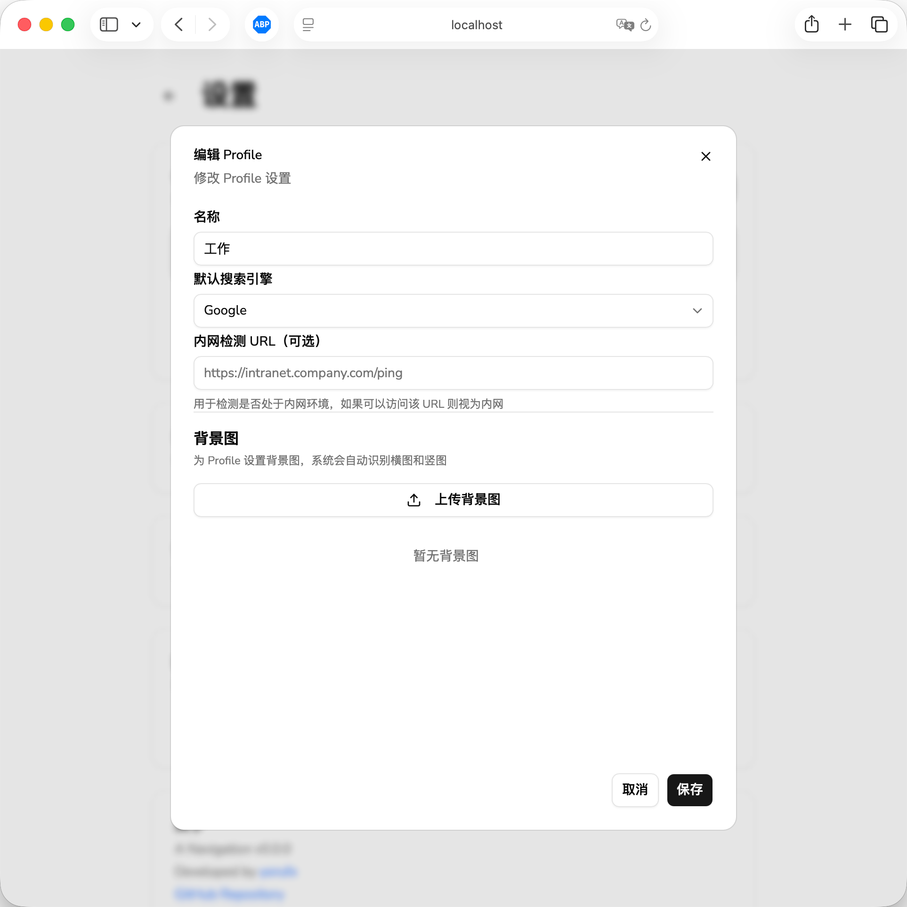
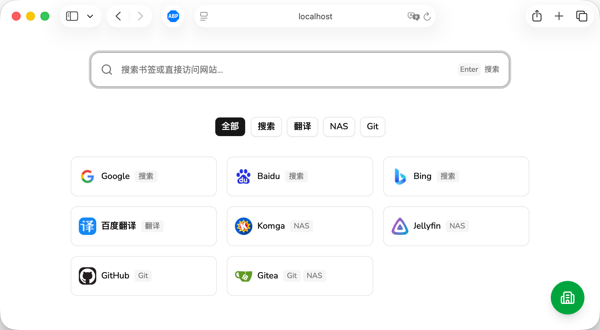

<h1 align="center">A Navigation</h1>

<p align="center">
  <a href="https://github.com/yorufx/anav/actions/workflows/ci.yml"></a>
  <a href="https://github.com/yorufx/anav/actions/workflows/docker.yml"></a>
</p>

<p align="center">
  <a href="./README.en.md">English</a> | <a href="./README.md">简体中文</a>
</p>

## 简介

## 核心功能 ✨

这是我为什么要自己开发一个导航页。

- 🌐 **内网检测** - 适用于家庭 NAS 服务，无需为局域网和穿透域名配置两个不同的书签
- 👤 **配置文件** - 在公司和家里的电脑使用不同的配置
- 🔍 **智能搜索** - 支持更便捷的操作，搜索或打开书签，自由配置各种搜索引擎

## 更多功能

没什么好说的。

- 🏷️ **标签系统** - 使用标签分类书签，支持拖拽排序
- 🌓 **主题切换** - 支持亮色/暗色主题，跟随系统或手动切换
- 🌍 **本地化文本** - 支持中文和英文界面
- 📱 **响应式设计** - 适配桌面和移动设备
- 🖼️ **背景图片** - 支持上传多张背景图，根据设备方向自动选择横图/竖图
- 🚀 **不占内存** - 使用 Rust 构建


## 开发

创建 `.env` 文件：

```text
VITE_API_URL="http://localhost:33989"
```

启动后端：

```bash
cargo run
```

启动前端：

```bash
bun run dev
```

## 构建 🛠

```bash
bun run build
cargo build --release
```

## 安装

### Docker

拉取并启动镜像：

```bash
# 拉取最新镜像
docker pull ghcr.io/yorufx/anav:latest

# 启动容器（使用默认配置）
docker run -d \
  --name anav \
  -p 33989:33989 \
  -v $(pwd)/config:/app/config \
  ghcr.io/yorufx/anav:latest
```

或者使用自定义环境变量：

```bash
docker run -d \
  --name anav \
  -p 33989:33989 \
  -v $(pwd)/config:/app/config \
  -e PORT=33989 \
  -e USERNAME=admin \
  -e PASSWORD=your_password \
  ghcr.io/yorufx/anav:latest
```

**参数说明：**

- `-p 33989:33989` - 端口映射，将容器内的 33989 端口映射到主机的 33989 端口
- `-v $(pwd)/config:/app/config` - 挂载配置目录，用于持久化书签、图标等数据
- `-e PORT=33989` - 设置服务端口（可选，默认 33989）
- `-e USERNAME=admin` - 设置登录用户名（可选，默认 admin）
- `-e PASSWORD=your_password` - 设置登录密码（可选，默认 admin）

**访问：**
启动后访问 `http://localhost:33989` 即可使用。

### 修改密码

初始用户名和密码由环境变量指定，保存在 `config/config.json` 中，后续修改直接修改此文件并重启容器。

## 使用教程 📖

### 快捷搜索

目标是对于常用的网页，只需按下 `Ctrl + T` + 几个字母筛选 + `TAB` 即可访问，不需要鼠标操作（类似于浏览器地址栏的操作方式）。

#### 默认搜索引擎

主页打开之后，自动聚焦搜索框，可直接输入并按回车搜索：



#### 快捷打开书签

搜索会对标签进行筛选，选中书签后，按 TAB 键直接进入该网页：



#### 使用书签搜索

书签可配置搜索模板 URL，实现快捷选择搜索引擎：

例如对于百度翻译，配置搜索 URL 为 `https://fanyi.baidu.com/mtpe-individual/transText?query={}`，对于配置了搜索 URL 的书签，TAB 键不再直接跳转网页，而是使用该书签进行搜索：



使用 TAB 键选择搜索引擎之后，继续按 TAB，直接跳转该网页；或者继续输入并回车，则使用该书签搜索。此例中直接跳转翻译结果。



### 配置文件

目的是在工作电脑和个人电脑上使用不同的收藏。



### 内网检测

用于家庭 NAS 服务，自动切换内网域名和外网域名。

在设置中添加一个内网 URL，每次打开导航页时，会自动检测该 URL 能否访问。访问成功后，所有书签切换为内网链接（如果有的话）。

**注意**：由于浏览器混合内容限制，如果导航页部署于 HTTPS 下，则内网检测链接也需要 HTTPS。



#### 内网模式

内网检测通过后，右下角设置图标会变成绿色：


